WAF Access Control Lists with Application Load Balancers

WAF Access Control Lists with Application Load Balancers	1
Overview	2
Prerequisites	2
Setup	2
Step 1: Create IP Set	2
Step 2: Create Web ACL	4
Add rules and rule groups	4
Set rule priority	4
Create Web ACL	4
Step 3: Verify setup	5
Step 4: Block the /admin path	5
Step 5: Add AWS managed rule	6
Step 6: Explore rules from AWS Marketplace	6
Step 7: Observability on Web ACL	6
Step 8: Teardown	7

Overview
This is an activity that introduces you to AWS Web Application Firewall (WAF). We would explore some rules we can apply on the WAF to protect our application that is made accessible through a public application load balancer.
Prerequisites
An existing VPC
An existing deployment that is accessible through a public application load balancer
Setup
Fork the repository (https://github.com/slim-sandbox/tf-ec2-alb) into your Github account
Clone the repository from your Github account into your workstation
https://github.com/KeenGWatanabe/terraform-ec2-alb-webapp
Set the necessary values for the region, VPC, and name in the Terraform code
Terraform apply
Step 1: Create IP Set
Do a web search for your public IPv4 address, and create an IP set on AWS WAF.

Using CIDR notation, a subnet mask can help represent a range of IPv4 addresses. When the subnet mask is /32, it simply represents a single IPv4 address.

Details
Name: <name>-ipset
Region: (Region of application deployment)
IP addresses: (Public IPv4 address in CIDR format)
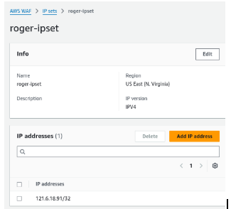
Step 2: Create Web ACL

Details and associated resources
Fill as follows,
Resource type: Regional
Name: <name>-webapp-acl
Associated AWS resources: (rger-webapp-alb)
Associate the Web ACL with the ALB:
Go to the AWS WAF & Shield Console.
Select your Web ACL.
Click Associated AWS resources.
Click Add AWS resources.
Select your Application Load Balancer from the list.
Click Add.
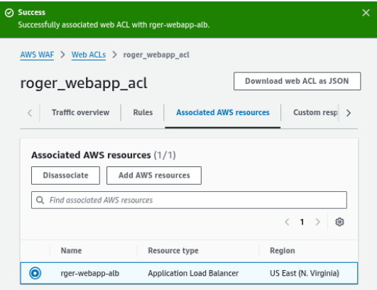
Add rules and rule groups
Just create your own rule for now.

Rule type: IP set; Type: Regular rule
Name: allow-ip 
IP set: (Select your IP set)
Originating address: Source IP address
Action: Allow

Set rule priority
Web ACL capacity units (WCUs) - Notice the WCUs increase with each additional rule.
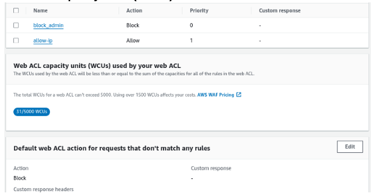
Default action that don’t match any rule: Block
Create Web ACL
Leave the rest of the configuration as default and create the web ACL
Verify the Configuration:
Ensure traffic to your EC2 instance flows through the ALB.
Test the /admin path to confirm it is blocked.

Step 3: Verify setup

Visit the website from your workstation. It should be accessible still
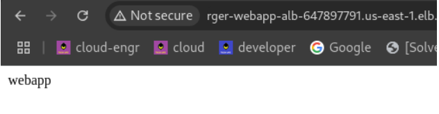

Visit the website from your mobile, with WiFi turned off. It should be blocked with a 403 Forbidden message
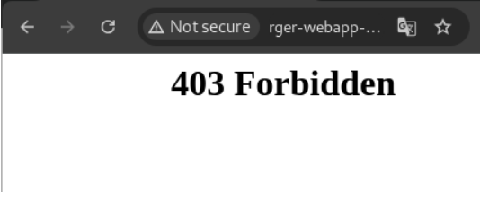

Step 4: Block the /admin path

Create a self-managed rule that will block access to the /admin path.
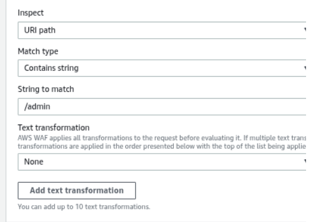
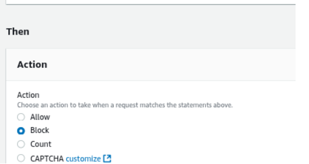
To validate the new rules in your browser, you would require to either clear the browser’s cache through the use of hard refresh, or use of Incognito mode.
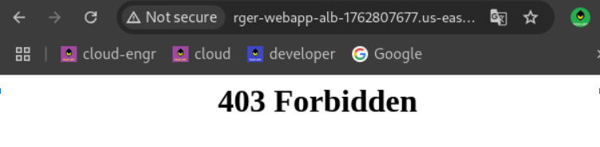
Question
Does the rule priority matter? Which rule is applied first?
Priority doesn’t matter.

Is the blocked path case sensitive? What can be done to ensure it is still blocked?
Can set to lowercase, regex pattern, or statements in web_acl rule

Step 5: Add AWS managed rule

Add a managed rule that will block the addresses of bad actors as identified by Amazon threat intelligence.
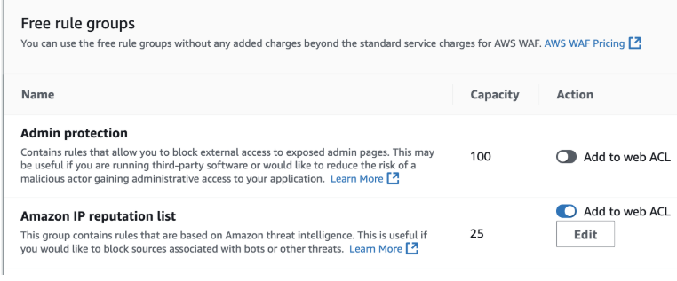

Have a read at the managed rule documentation to know what it does.
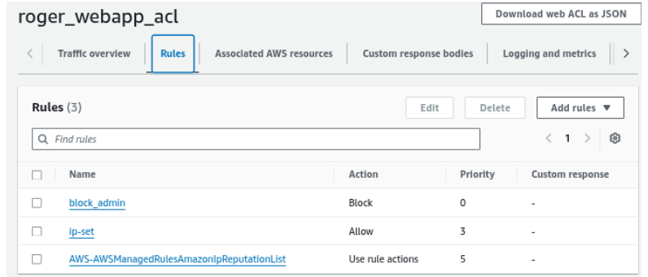
Question
Are there any overwrites, needed on the rule actions, to block the addresses that have been identified as actively engaging in malicious activities?
What should the rule priority be?
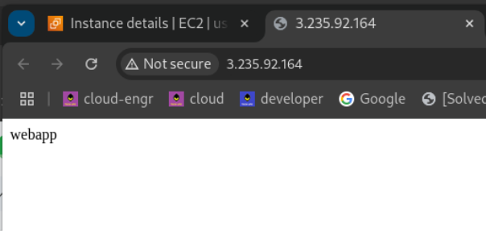

From this exercise the WAF web ACL only works on alb-domains-to-the-webapp but still the public ip address where the web app is hosted is still accessible.  Therefore, 
1. hard-code the specific ip address + block all traffic setting in security group ingress,
2. update DNS, point domain name to ALB's DNS instead of EC2 public IP
3. launch EC2 without public IP address, need NAT gw for egress while EC2 in pte subnet.
Above 3 is the additional security to protect web_app access.

Step 6: Explore rules from AWS Marketplace

Identify who are the third-party providers that provide rules for protection against OWASP Top 10
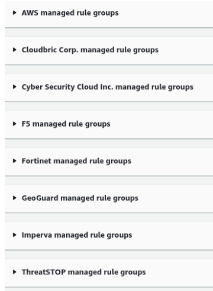
Step 7: Observability on Web ACL

It might be surprising to see that it did not take much time to have web requests made:
by bots
from regions outside of Singapore
to reach the admin pages

Step 8: Teardown

Check for assignment requirements before tearing down the created resources.

Destroy the WAF resources created via the console
Destroy the Web Application resources created via Terraform.

Step 9: Questions
Would you want to block all bots? Why not?
Pros:
Security: By blocking bots, you can reduce the risk of malicious activities such as DDoS attacks, scraping, and other automated threats.
Performance: Bots can consume resources and slow down your website. Blocking them can improve your site's performance.
Data Integrity: Preventing bots from accessing your site ensures that your analytics data remains accurate, reflecting genuine user interactions.
Cons:
Good Bots: Not all bots are bad. Search engine crawlers, such as those from Google and Bing, help index your site and make it searchable. Blocking these can negatively impact your SEO.
False Positives: Some legitimate users or services might be mistaken for bots and get blocked, leading to a poor user experience.
Maintenance: Managing and maintaining bot rules can be time-consuming, as you'll need to constantly update and tweak settings to ensure the right balance.
Balanced Approach:
Instead of blocking all bots, consider using a more nuanced approach:
Rate Limiting: Restrict the number of requests from a single IP address in a given time frame.
CAPTCHA: Implement CAPTCHA challenges to differentiate between humans and bots.
Bot Management Solutions: Use advanced bot management solutions that can identify and allow good bots while blocking malicious ones.

