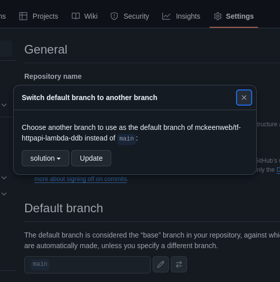

# Slides: Monitoring, Logging, Cost Optimization
https://docs.google.com/presentation/d/1BJp4ZMDDmkKYyjpXXbW8Tyd2barhHJVv05my6l_4MCs/edit#slide=id.p1

# Activity: Logs, Metrics, Alerts 
https://docs.google.com/document/d/1I-k4pfLQZxK6Xk5OoO71mTrttGQnIkqQNW3W60WM2yQ/edit?tab=t.0#heading=h.gjdgxs

# Activity-rger
https://docs.google.com/document/d/1yKLLkc3plJoqbM9uvOydGpx4REOlrQiU3hAzjy7Vwmo/edit?tab=t.0#heading=h.gjdgxs

# tf-httpapi-lambda-ddb
https://github.com/mckeenweb/tf-httpapi-lambda-ddb

# tf-cloudwatch-alarm
https://github.com/KeenGWatanabe/tf-cloudwatch-alarm

